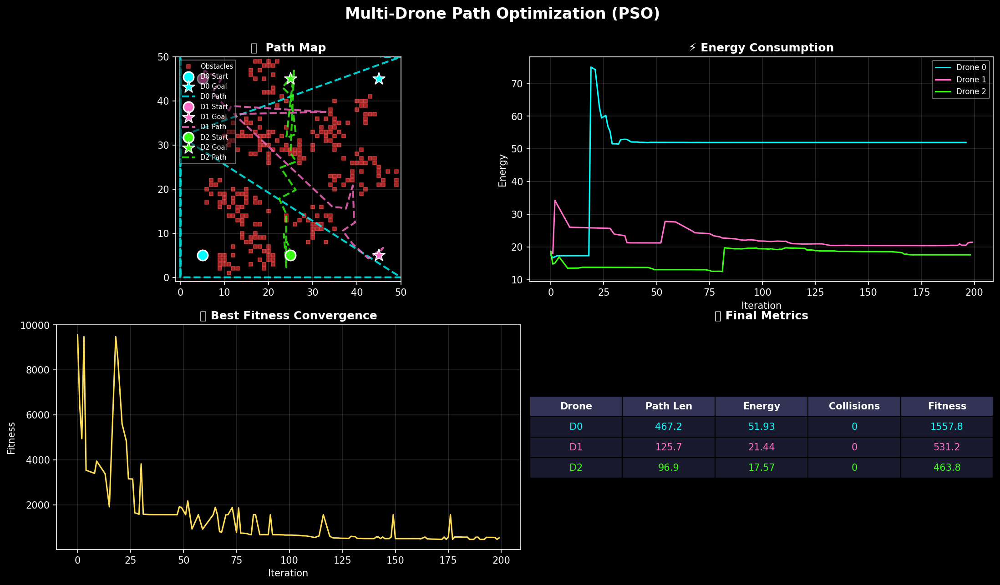

# 🚁 Multi-Drone 3D Path Optimizer

A real-time multi-drone 3D path optimization simulation using **RRT\*** (Rapidly-exploring Random Tree Star) with **B-Spline** trajectory smoothing. Features an interactive Three.js dashboard with live WebSocket telemetry.



## ✨ Features

- **RRT\* Algorithm in 3D** — Asymptotically optimal path planning in continuous space
- **Energy-Aware Cost Model** — Optimizes for distance, altitude gain, and wind drag
- **B-Spline Trajectory Smoothing** — Converts raw waypoints into flyable paths
- **Interactive 3D Dashboard** — Three.js visualizer with orbit, pan, and zoom controls
- **Real-Time WebSocket Streaming** — Live path updates and fleet telemetry
- **Detailed Quadcopter Models** — Animated drones with spinning propellers and movement tilt
- **Environment Editor** — Click to modify buildings, place obstacles, randomize maps
- **Simulation History** — Auto-save, replay, and compare past simulations
- **Scenario Management** — Export/import full environment configurations as JSON

## 🛠 Tech Stack

| Layer | Technology |
|---|---|
| **Backend** | Python, FastAPI, Uvicorn |
| **Math** | NumPy, SciPy (B-Splines) |
| **Frontend** | HTML5, TailwindCSS, Three.js (r128) |
| **Communication** | WebSockets (real-time), REST API |

## 🚀 Quick Start

### Prerequisites
- Python 3.8+

### Local Development

```bash
# Clone the repository
git clone https://github.com/yourusername/drone-path-optimizer.git
cd drone-path-optimizer

# Install dependencies
pip install -r requirements.txt

# Start the server
python server.py
```

Open **http://localhost:8000/static/index.html** in your browser.

### Deploy to Render

1. Push your code to GitHub
2. Go to [render.com](https://render.com) → **New** → **Web Service**
3. Connect your GitHub repo
4. Render will auto-detect `render.yaml` and configure everything
5. Click **Create Web Service**

Your app will be live at `https://your-app.onrender.com/static/index.html`

## 📖 Usage

1. **Start** — Click the ▶ Start button to begin RRT* path planning
2. **Orbit** — Left-click + drag to rotate the camera
3. **Pan** — Middle-click + drag to move the view
4. **Zoom** — Scroll to zoom in/out
5. **Edit** — Toggle Edit Mode to click buildings and change heights
6. **Add Obstacles** — Click Add Obstacle, then click the ground
7. **Randomize** — Generate a fresh city layout
8. **Controls** — Click the ☰ menu to access parameters, history, and fleet status

## 📁 Architecture

```
├── server.py        # FastAPI server, WebSocket handler, simulation storage
├── planner.py       # RRT* search + B-Spline trajectory smoothing
├── environment.py   # 3D grid, obstacle management, bounds checking
├── index.html       # Three.js dashboard + UI (single-file frontend)
├── requirements.txt # Python dependencies
├── render.yaml      # Render deployment config
└── README.md
```

## 📄 License

MIT License